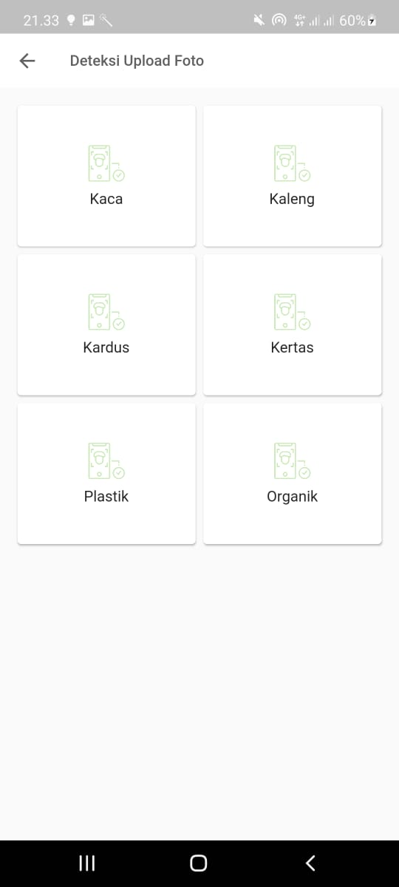

# flutter_klasifikasi_jenis_sampah

Real-time object detection in Flutter using [camera](https://pub.dartlang.org/packages/camera) and [tflite](https://pub.dartlang.org/packages/tflite) plugin. 

## Install 

```
flutter packages get
```

## Run

```
flutter run
```

## Models

- Image Classification
  - MobileNet

## Previews




